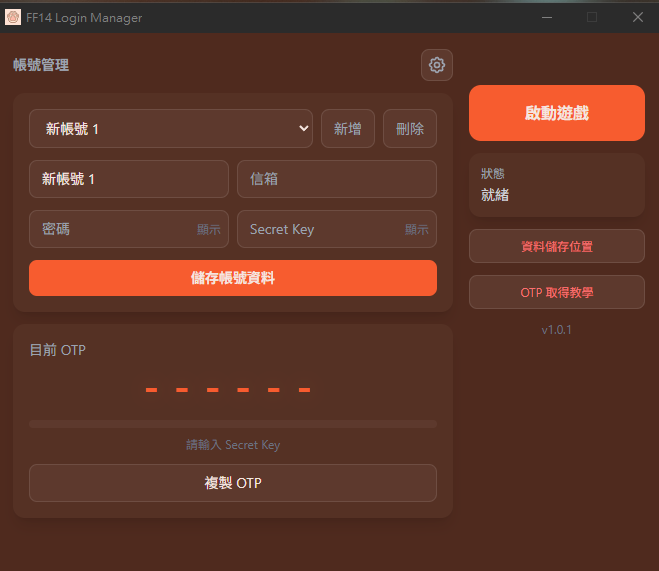
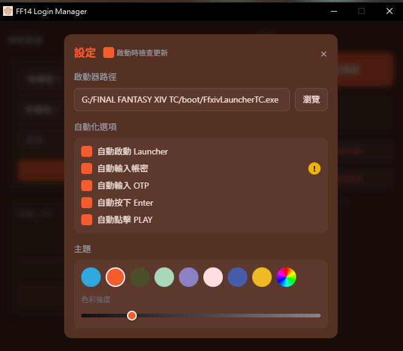

# FF14 Login Manager

Final Fantasy XIV 登入管理器 - 自動化 OTP 輸入與多帳號管理工具

## 功能特色

- **多帳號管理** - 儲存多組帳號的信箱、密碼、Secret Key
- **OTP 自動產生** - 即時顯示一次性密碼，支援複製功能
- **自動化登入** - 自動啟動 Launcher、輸入 OTP、點擊 PLAY
- **QR Code 掃描** - 從 Google Authenticator 匯出的 QR Code 提取 Secret Key
- **主題切換** - 8 種顏色切換 + 明暗度調整
- **DPAPI** - 微軟帳密加密所輸入的密鑰
## 下載

前往 [Releases](https://github.com/yen58767/FF14_TW_LoginManager/releases) 下載最新版本

## 使用方式

1. 下載並執行 `FF14_Login_Manager.exe`
2. 點擊齒輪圖示設定啟動器路徑（選擇 `ffxivboot.exe`）
3. 新增帳號並輸入 Secret Key
4. 點擊「啟動遊戲」即可自動完成登入流程

## 如何取得 Secret Key

1. 開啟 Google Authenticator App
2. 點擊左上角選單 → 轉移帳戶 → 匯出帳戶
3. 選擇 FF14 帳戶，獲得 QR Code
4. 在本程式的「OTP 取得教學」中點擊「點此取得 Secret Key」
5. 上傳 QR Code 圖片即可提取

## 截圖





## 自行建置

### 環境需求

- Python 3.10+
- Windows 10/11

### 安裝相依套件

```bash
pip install -r requirements.txt
```

### 執行

```bash
python ff14_launcher.py
```

### 打包成 EXE

#### 使用 PyInstaller

```bash
pip install pyinstaller
pyinstaller --onefile --windowed --name "FF14_Login_Manager" --add-data "web;web" --icon "web/favicon.ico" ff14_launcher.py
```

打包完成後，執行檔位於 `dist/FF14_Login_Manager.exe`

#### 使用 Nuitka(目前Releases打包方式)

需先安裝 [Visual Studio Build Tools](https://visualstudio.microsoft.com/visual-cpp-build-tools/)，並勾選「使用 C++ 的桌面開發」工作負載。

```bash
pip install nuitka
python -m nuitka --onefile --windows-disable-console --windows-icon-from-ico=web/favicon.ico --include-data-dir=web=web --include-module=comtypes.stream --msvc=latest ff14_launcher.py
```

打包完成後，執行檔位於 `ff14_launcher.exe`

## 注意事項

- 帳號資料儲存於 `%USERPROFILE%\.ff14_login_config.json`
- 請妥善保管您的 Secret Key，切勿分享給他人
- 本工具僅供個人使用，請遵守遊戲服務條款

## 授權

MIT License
